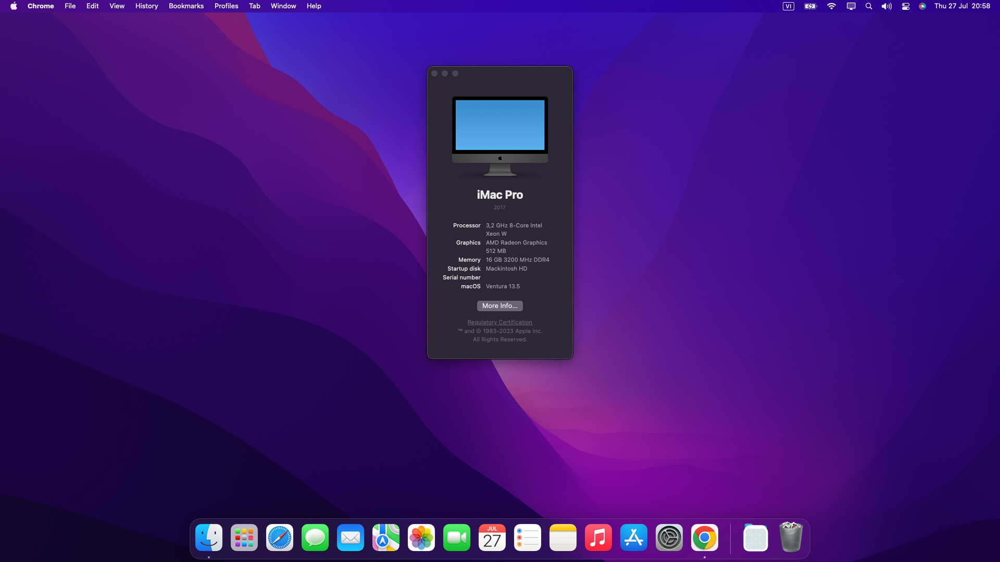

# Opencore EFI for Laptop AMD

**Opencore version: [0.9.3](https://github.com/acidanthera/OpenCorePkg/releases/)**  
**macOS version: Ventura 13.5**

## Disclaimer:

## Important: Follow the below before boot with this EFI

### SSDTs

**Using [SSDTTime](https://github.com/corpnewt/SSDTTime)**

1. Start with option `P`. It dumps the current system's DSDT, which will be utilised in order to create these SSDTs and patches.
   - `FixHPET` (Choose option `C` which only patches conflicting IRQs from legacy devices)
   - `USBX` (choose the default option `B` key)
   - `RTCAWAC`
   - `PluginType`  
     **For AMD Laptop**
   - `FakeEC Laptop`
   - `PLNF`
   - `XOSI` (Choose default `A` key)
2. Copy all the files that start with SSDT and end in `*.aml` inside of Drive `/EFI/OC/ACPI`
3. Finally, merge `patches_OC.plist` by using the PatchMerge script included with SSDTTime. Run it the same way as SSDTTime

Or you can start the guide [here](https://nootinc.github.io/guide/gathering-files/acpi)

### Kext

&ensp;Used [Nootedred.kext](https://github.com/NootInc/NootedRed) instead of [WhateverGreen.kext](https://github.com/acidanthera/WhateverGreen/releases) but still include [WhateverGreen.kext](https://github.com/acidanthera/WhateverGreen/releases) in [zip file](EFI/OC/Kexts/WhateverGreen.kext.zip)

&ensp;Recommend use [itlwm.kext](https://github.com/OpenIntelWireless/itlwm/releases) and [Heliport.dmg](https://github.com/OpenIntelWireless/HeliPort/releases) instead [AirportItlwm.kext](https://github.com/OpenIntelWireless/itlwm/releases)

### config.plist [Setup](https://dortania.github.io/OpenCore-Install-Guide/AMD/zen.html#starting-point)

&ensp;**Rename `.modify_this_config.plist` to `config.plist`**  
&ensp;**Any changes in EFI folder you must be take OC clean snapshot config.plist with [ProperTree](https://github.com/corpnewt/ProperTree)**

**DeviceProperties**  

**NVRAM**  
&ensp;boot-args: `keepsyms=1 alcid=11 debug=0x100 agdpmod=pikera npci=0x2000 swd_panic=1`  
add `-v`  
replace `xx` in `alcid=xx` with your layout-id  

**PlatformInfo**  
&ensp; Use [GenSMBIOS](https://github.com/corpnewt/GenSMBIOS) to generate your own SMBIOS

**Misc > Debug**

- If you want enable all logging
  - AppleDebug = YES
  - ApplePanic = YES
  - Target = 67

## Laptop Asus Vivobook Pro 15 OLED M3500QC:

- CPU model: AMD Ryzen 7 5800H with Radeon Graphics
- GPU model:
  - [x] AMD Radeon (TM) Graphics
  - [ ] NVIDIA GeForce RTX 3050 Laptop GPU
- Chipset Model:
- Keyboard, trackpad:
  - Keyboard: PS2
  - Trackpad: I2C
- Audio
  - Realtek ALC294 @ AMD K19.5 - Audio Processor - High Definition Audio Controller (Standalone AZ)
  - Audio Codec: 11
- Network Controller models: Intel(R) Wi-Fi 6 AX200 160 MHz
- Drive Model:


## Post-install

### What is working?

- Camera
- Speaker build-in
- Wifi
- Radeon Graphics (with 512MB memory)
- Battery percentage
- iMessage

### What is not working?

- NVIDIA GPU
- Trackpad (not patched/fixed yet)
- Microphone build-in
- Bluetooth
- Sleep
- 
### Emulated NVRAM
## Structure folder:

```
├── EFI
│   ├── BOOT
│   │   └── BOOTx64.efi
│   └── OC
│       ├── ACPI
│       │   ├── SSDT-EC.aml
│       │   ├── SSDT-HPET.aml
│       │   ├── SSDT-PLUG-ALT.aml
│       │   ├── SSDT-PNLF.aml
│       │   ├── SSDT-USBX.aml
│       │   └── SSDT-XOSI.aml
│       ├── Drivers
│       │   ├── HfsPlus.efi
│       │   ├── OpenCanopy.efi
│       │   ├── OpenRuntime.efi
│       │   └── OpenVariableRuntimeDxe.efi
│       ├─ Kexts
│       │   ├── AirportItlwm_Ventura.kext
│       │   ├── AMDRyzenCPUPowerManagement.kext
│       │   ├── AmdTscSync.kext
│       │   ├── AppleALC.kext
│       │   ├── AppleMCEReporterDisabler.kext
│       │   ├── ECEnabler.kext
│       │   ├── Lilu.kext
│       │   ├── NootedRed.kext
│       │   ├── NVMeFix.kext
│       │   ├── RadeonSensor.kext
│       │   ├── SMCAMDProcessor.kext
│       │   ├── SMCBatteryManager.kext
│       │   ├── SMCRadeonGPU.kext
│       │   ├── USBToolBox.kext
│       │   ├── UTBMap.kext
│       │   ├── VirtualSMC.kext
│       │   ├── VoodooPS2Controller.kext
│       │   ├── HeliPort.dmg
│       │   └── itlwm.kext.zip
│       ├── Resources
│       │   ├── Audio
│       │   ├── Font
│       │   ├── Image
│       │   └── Label
│       ├── Tools
│       │   └── OpenShell.efi
│       ├── .modify_this_config.plist
│       └── OpenCore.efi
```

## Images:



## Preferences:

**[Dortania](https://dortania.github.io/)**  
**[Noot](https://nootinc.github.io/)**
